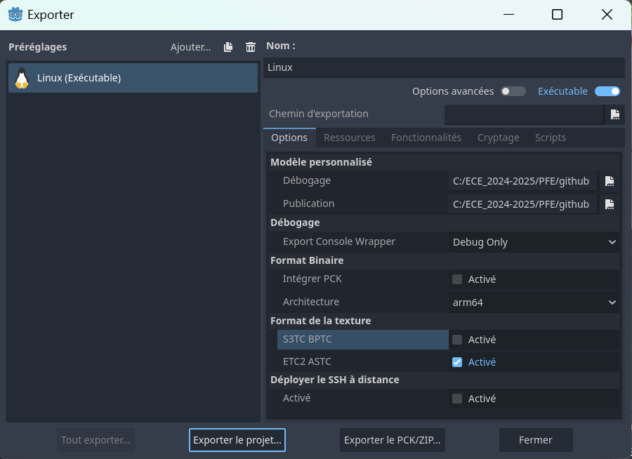

## Projet Arcade en 3D avec Godot et Blender

Ce projet est un jeu d'arcade 3D développé avec le moteur de jeu Godot et des modèles 3D créés avec Blender. Ce README couvre les étapes d'installation, la structure du projet, ainsi que les instructions pour collaborer via Git.

## Prérequis

Godot Engine (v4.3 ou plus récent) pour développer et tester le jeu.

Blender (v3.x ou plus récent) pour créer et éditer les modèles 3D.

Git pour la gestion de version et le suivi des modifications du projet.

## Installation et Configuration

# 1. Cloner le dépôt

Clonez le dépôt sur votre machine locale :

`git clone https://github.com/yannpradel/pfe_borne_arcade_godot.git
cd pfe_borne_arcade_godot`

# 2. Lancer le projet dans Godot

Ouvrez Godot Engine.

Sélectionnez Import et choisissez le dossier du projet cloné.

Le projet devrait apparaître dans la liste des projets de Godot. Cliquez pour l'ouvrir.

# 3. Ajouter ou Modifier des Modèles 3D avec Blender

Les modèles 3D sont organisés dans le dossier assets/models/ :

Ouvrez un fichier .blend dans Blender pour modifier ou créer des modèles.

Pour ajouter une texture :

Sélectionnez votre objet et passez en Mode Édition.

Ajoutez une nouvelle texture via le panneau Materials et chargez une image dans le nœud Image Texture.

Les textures doivent être stockées dans assets/textures/ pour une meilleure organisation.

# 4. Intégration des Modèles 3D dans Godot

Pour utiliser un modèle Blender dans Godot :

Enregistrez votre fichier .blend dans le dossier map/model/map.blend.

Godot détectera et importera automatiquement le fichier .blend.

Utilisez les scènes importées dans vos scènes Godot pour ajouter les modèles.

# Structure du Projet

*pfe_borne_arcade_godot/   
├── assets - blender/  
│   ├── models/            # Modèles 3D (Blender)  
│   ├── textures/          # Textures et images  
├── export/                # Fichiers d'export du jeu et paramètre  
├── fonts/                 # Polices d'écritures  
├── icon/                  # Icone du jeu  
├── map/  
│   ├── model/             # Map du jeu pour Godot    
├── music/                 # Musique du jeu  
├── python udp/            # Scripts python pour la communication avec le matériel  
├── release-debug/         # Fichiers d'export pour l'architecture Linux Raspbian ARM64  
├── scripts_godot/         # Scripts Godot  
├── shader_godot/          # Shader Godot  
├── tscn_godot/            # Modèle 3D Godot  
├── mod.sh                 # Script de lancement shell pour la Raspbian  
└── project.godot          # Fichier de configuration du projet Godot*  

# Commandes Git de Base

Initialiser un dépôt Git (si ce n'est pas déjà fait)

`git init
git remote add origin https://github.com/yannpradel/pfe_borne_arcade_godot.git`

Commandes de base pour la gestion des versions

Ajouter des fichiers :

`git add .`

Commit des modifications :

`git commit -m "Description des modifications"`

Pousser les changements vers GitHub :

`git push origin main`

Gestion des branches

Pour travailler sur une fonctionnalité spécifique :

`git checkout -b nom_de_la_branche`
# Après avoir travaillé et fait des commits
`git push origin nom_de_la_branche`

Optimisation des Performances dans Godot

Pour améliorer les FPS (notamment sur Raspberry Pi) :

Dans les paramètres du projet, activez le Mode Mobile sous Rendering > Quality.

Réduisez la qualité des ombres et des effets visuels.

Activez le Low Processor Mode et ajustez Low Processor Mode Sleep µSec pour réduire l'utilisation du CPU.

Contribuer

Si vous souhaitez contribuer :

Créez une nouvelle branche pour votre fonctionnalité.

Faites un commit de vos modifications.

Envoyez une pull request sur le dépôt principal.

Merci de votre intérêt pour ce projet ! Toute contribution est la bienvenue pour améliorer l'expérience de jeu et optimiser les performances.

Pour toute question, n'hésitez pas à ouvrir une issue sur le dépôt GitHub.

# Export du jeu ave Godot 

Pour le fichier dans Débogage, mettre le .debug du dossier release-debug/, et pour le Publication, mettre le .release du même dossier. 

